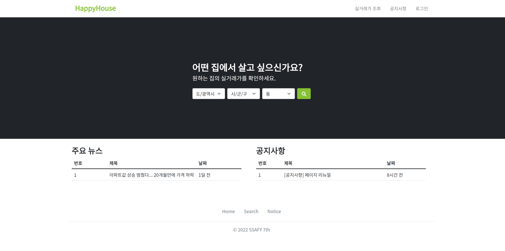
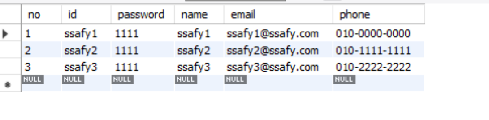
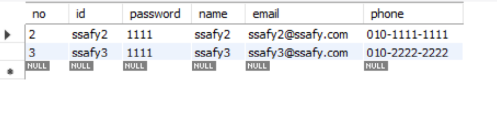

# HappyHouse: 권덕주, 김시언

## 구현 여부

### 요구 사항

|      구현 기능      | 구현 여부 |
| :-----------------: | :-------: |
|      메인 화면       |     ✔     |
| 실거래가 검색, 결과   |     ✔     |
|      회원 관리       |     ✔     |
|   로그인/로그아웃    |     ✔     |
|    공지사항 관리     |     ✔     |

 

### 보완 사항

 

### UseCase Diagram

 

### Class Diagram

 

- Controller
  - [AuthController.java](src/main/java/com/ssafy/web/controller/AuthController.java)
  - [BoardController.java](src/main/java/com/ssafy/web/controller/BoardController.java)
  - [HouseController.java](src/main/java/com/ssafy/web/controller/HouseController.java)
- Service

  - [HouseService.java](./src/web/service/HouseService.java)
  - [HouseServiceImpl.java](./src/web/service/HouseServiceImpl.java)
  - [PostService.java](./src/web/service/PostService.java)
  - [PostServiceImpl.java](./src/web/service/PostServiceImpl.java)
  - [UserService.java](./src/web/service/UserService.java)
  - [UserServiceImpl.java](./src/web/service/UserServiceImpl.java)

- DAO

  - [PostDao.java](./src/web/dao/PostDao.java)
  - [PostDaoImpl.java](./src/web/dao/PostDaoImpl.java)
  - [UserDao.java](./src/web/dao/UserDao.java)
  - [UserDaoImpl.java](./src/web/dao/UserDaoImpl.java)

- DTO
  - [UserDto.java](./src/web/model/UserDto.java)
  - [PostDto.java](./src/web/model/PostDto.java)
  - [HouseDealDto.java](./src/web/model/HouseDealDto.java)

 

## 실행 화면

### 1. 메인 페이지

#### 첫 화면: [index.jsp](./WebContent/index.jsp)

 

### 2. 실거래가 검색/조회

#### 초기 화면: [search.jsp](./WebContent/search.jsp)

 

#### 동별실거래가 조회: search.jsp

 

#### 상세정보 조회: search.jsp => 모달을 이용하여 구현

 

### 3. 로그인/로그아웃

 

#### 로그인 초기 화면
 

#### 로그인 성공
 

#### 로그인 실패
 

 

### 4. 회원 관리
 

#### 회원 가입 페이지
 

#### 회원 가입 성공시
 

#### 회원 가입 실패 - 항목을 모두 입력하지 않았을 경우
 

#### 회원 가입 실패 - 이미 존재하는 아이디로 가입하려 했을 경우
 

#### 아이디 몇 개를 회원 가입한 후 db 상태
 

#### ssafy1 아이디로 로그인 후 마이페이지 진입(우측 상단의 아이콘 클릭 시)
 

#### 회원 정보 변경(예시에서는 이름, 이메일 전화번호 변경)
 

#### 회원 정보 변경 후 db
 

#### 회원 탈퇴
 

#### 회원 탈퇴 후 db
 

 

### 5. 공지사항 관리

#### 초기 화면 : postList.jsp

 

#### 글 작성 화면 : [addPost.jsp](./WebContent/board/addPost.jsp)

 

#### 몇 개 글 작성 이후 : [postList.jsp](./WebContent/board/postList.jsp)

 

#### 글 작성 후 DB 상태

 

#### 글 수정 : [updatePost.jsp](./WebContent/board/updatePost.jsp)

 

#### 글 수정 반영됨 : postList.jsp

 

#### 글 수정이 반영된 상세 화면 : [post.jsp](./WebContent/board/post.jsp)

 

#### 글 수정 후 DB 상태

 

#### 2번 글 삭제 후 화면: postList.jsp

 

#### 글 삭제 후 DB 상태

 
